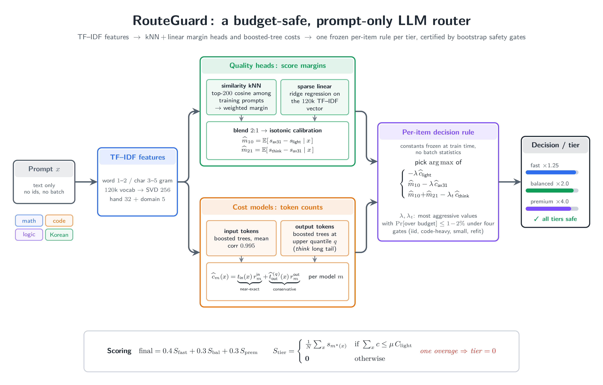

# Efficient LLM Routing Challenge

프롬프트만 보고 세 후보 모델(`ax31-light`, `ax31`, `axk1-think`) 중 하나를 골라,
정해진 예산 안에서 답변 품질을 최대한 끌어올리는 라우터입니다. 모델을 직접
호출하지는 않고, 각 모델이 미리 만들어 둔 답 중 하나를 선택하는 방식입니다.

세 등급(fast, balanced, premium)마다 예산 한도가 있고, 한 등급이 한도를 넘으면
그 등급은 0점이 됩니다.

## 이 라우터가 하는 일

문항마다 독립적으로, "더 큰 모델로 바꾸면 점수가 얼마나 오르는가"와 "비용이
얼마나 드는가"를 예측해서 기대 품질에서 비용 벌점을 뺀 값이 가장 큰 모델을
고릅니다. 벌점 상수는 학습 때 정해 굳혀 두므로 실행 중에 배치 통계를 쓰지
않고, 같은 프롬프트는 입력 순서와 무관하게 항상 같은 모델로 갑니다. 신경망이나
인터넷 없이 numpy만 쓰는 작은 오프라인 컨테이너로 돌아갑니다.



<details>
<summary>동작 방식 자세히</summary>

- 품질 예측: 프롬프트를 단어·문자 TF-IDF와 SVD 벡터로 바꾼 뒤, light 대비
  ax31, ax31 대비 think의 기대 점수차 두 개를 예측합니다. 비슷한 학습 질문들의
  점수차를 빌려오는 이웃 방식과 희소 선형 회귀를 섞고, 등화 보정으로 실제 점수
  단위에 맞춥니다.
- 비용 예측: 입력 토큰 수는 프롬프트 길이로 거의 정해지니 그대로 쓰고, 불확실한
  출력 토큰은 평균이 아니라 상위 분위수로 잡아 답이 길게 나오는 꼬리를 흡수합니다.
- 결정 규칙: 문항마다 세 모델의 "기대 품질 − 벌점 × 예상 비용"을 비교해 가장 큰
  쪽을 고릅니다. 등급별 벌점 상수는 학습 데이터의 재표집 검사(무작위, 코드 편중,
  작은 평가셋, 재학습 편차)를 모두 통과하는 가장 공격적인 값으로 학습 때
  고정합니다. 데이터가 코드로 치우쳐 답이 길어져도 한도를 넘지 않습니다.

라우터 본체는 [`src/ossp_router/model_router.py`](src/ossp_router/model_router.py)와
[`src/ossp_router/textfeat.py`](src/ossp_router/textfeat.py),
결정성 회귀 테스트는
[`tests/test_model_router_determinism.py`](tests/test_model_router_determinism.py)에 있습니다.
</details>

## 실행

```bash
for t in fast balanced premium; do
  PYTHONPATH=src python -m ossp_router.model_router \
    --input data/dev/inputs-base.json --tier $t --output out/$t.json
done
```

## 대회 규칙과 채점

자세한 규칙, 데이터, 채점 방식, 실행 한도는 `docs/` 아래 문서를 참고하세요.

- [docs/CHALLENGE_RULES.md](docs/CHALLENGE_RULES.md) — 과제 규칙
- [docs/SCORING.md](docs/SCORING.md) — 채점 방식
- [docs/RUNTIME.md](docs/RUNTIME.md) — 컨테이너 실행 한도
- [docs/SUBMISSION.md](docs/SUBMISSION.md) — 제출 절차
